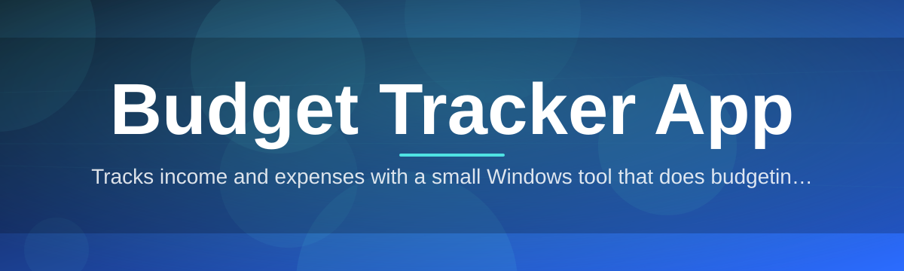

# budget-tracker-manager 💰📊

  

*Your money, mapped out — one clean ledger instead of ten scattered spreadsheets.*

  

## 📖 Overview

Every budget tracker starts the same way: a well-meaning spreadsheet that gets abandoned by week three. **budget-tracker-manager** was born out of that exact frustration — a small side project in 2025 that outgrew its own spreadsheet, then outgrew a clunky prototype, and eventually became a full standalone desktop app for people who just want to know where their money actually goes. No accounts to register, no cloud sync you didn't ask for, no subscription creeping into your bank statement. Just a fast, local, Windows-native budget tracker app that opens in seconds and gets out of your way.

This project exists for the person who wants real control over personal finance tracking without becoming a spreadsheet engineer. Whether you're managing a household budget, tracking freelance income against irregular expenses, saving toward a specific goal, or just trying to figure out why your grocery bill keeps climbing — budget-tracker-manager gives you the categorization, the visual breakdowns, and the historical trends to actually see the pattern instead of guessing at it.

It's built for students balancing part-time income, families juggling shared expenses, freelancers with lumpy cash flow, and anyone who has ever opened their banking app and thought "where did it all go?" If that's you, keep reading — this doc covers everything from first launch to keyboard shortcuts to how the whole thing is wired together under the hood.

---

## 🔥 What's Inside the Ledger

- **Envelope-style budgeting** — allocate a monthly amount per category and watch a live progress bar tell you exactly how close you are to the edge, before the edge finds you.

- **Multi-account overview** — checking, savings, cash, credit — track them side by side without switching apps or juggling five separate spreadsheets.

- **Recurring transaction memory** — rent, subscriptions, and paychecks get remembered so you're not re-typing the same line item on the 1st of every single month.

- **Visual spending breakdowns** — pie charts and trend lines turn a wall of numbers into a shape you can actually recognize and react to.

- **Custom categories & tags** — the default categories are a starting point, not a cage; rename, merge, or split them however your actual spending behaves.

- **Local-first data storage** — your financial data lives on your machine, not on someone else's server, which means no waiting on a connection to see your own numbers.

- **Goal tracking** — set a savings target with a deadline and get a straightforward "on pace" or "off pace" readout instead of vague encouragement.

- **CSV import & export** — bring in bank statement exports or move your data elsewhere without lock-in; your budget history is yours to carry.

> [!TIP]
> Set up your recurring bills *first* during onboarding — it takes two minutes and saves you from re-entering the same five transactions every single month.

---

## 🚀 Getting Off the Ground

1. Head to the landing page using the download button above or below.

2. Grab the latest Windows build — it's a standalone package, no separate installer stack required.

3. Launch the executable. First run walks you through setting your primary currency, your first account, and a starter set of categories.

4. Start logging transactions — either manually or via CSV import — and the dashboard starts filling in immediately.

> [!NOTE]
> There is no account creation and no sign-in step. The app treats your machine as the only place your financial data needs to exist.

---

## 🖥️ System Requirements

| Requirement | Details |
|---|---|
| OS | Windows 10 or Windows 11 (64-bit) |
| Dependencies | None — fully standalone, nothing extra to set up |
| Disk space | Under 200 MB, plus your data file |
| RAM | 4 GB minimum, 8 GB recommended for large transaction histories |
| Internet | Not required after download — the app runs fully offline |

  

---

## ⚙️ How It Works

The mental model behind budget-tracker-manager is deliberately simple — a straight pipeline from raw entry to readable insight, with no hidden middle step:

1. **Capture** — you log a transaction manually or import a batch via CSV.

2. **Categorize** — the app auto-suggests a category based on past patterns, and you confirm or override it.

3. **Aggregate** — every entry rolls up into your monthly budget totals per category and per account.

4. **Visualize** — the dashboard renders charts and progress bars from that aggregated data, updated in real time.

5. **Review** — trend views let you compare month over month, so drift in spending becomes visible instead of invisible.

> [!IMPORTANT]
> Categorization overrides are remembered per merchant name, so correcting a category once trains the app for every future occurrence of that transaction.

---

## 🧩 Troubleshooting

<strong>My CSV import skipped some transactions — why?</strong>

 

The importer expects a date, description, and amount column at minimum. Rows missing any of those three are skipped and flagged in the import summary rather than silently dropped — check the summary log after each import.

<strong>My monthly totals look off after editing a past transaction.</strong>

 

Aggregates recalculate automatically, but only for the month the transaction belongs to. If you moved a transaction's date across a month boundary, both the old and new month's totals need a manual refresh — hit F5 or use the refresh icon on the dashboard.

<strong>Can I track a budget in more than one currency?</strong>

 

Yes — each account can carry its own currency setting. The dashboard totals convert to your primary currency using the exchange rate you set manually, since the app doesn't phone out to the internet for live rates.

<strong>Where is my data actually stored?</strong>

 

In a local data file in your user directory. There's no cloud copy by default — back it up the same way you'd back up any other important local file.

<strong>The app won't launch after a Windows update.</strong>

 

This is usually a stale shortcut pointing at a moved file. Re-launch from the original extracted folder, or re-download from the landing page if the folder was deleted.

> [!WARNING]
> Deleting your local data file without exporting a backup first is permanent — there is no server-side copy to recover it from.

---

## 🎨 Interface, Shortcuts & Themes

Budget-tracker-manager leans on keyboard-driven speed for people who add transactions constantly and don't want to reach for the mouse every time.

| Shortcut | Action |
|---|---|
| `Ctrl + N` | New transaction |
| `Ctrl + Shift + N` | New recurring transaction |
| `Ctrl + F` | Search transactions |
| `Ctrl + E` | Export current view to CSV |
| `Ctrl + I` | Import CSV |
| `Ctrl + ,` | Open settings |
| `F5` | Refresh dashboard aggregates |
| `Esc` | Close active dialog |

- **Themes** — Light, Dark, and a high-contrast mode for easier readability on projector-quality laptop screens.

- **Dashboard layout** — reorder widgets (charts, envelope bars, recent transactions) via drag-and-drop.

- **Number formatting** — toggle thousands separators and decimal precision in Settings → Display.

- **Compact mode** — collapses row height for people who track dozens of transactions a day and want more on screen at once.

> [!TIP]
> Dark mode plus compact mode together is the closest thing this app has to a "power user" setup — try it if the default view feels roomy.

---

## 🤝 Contributing & Community

This project grows because people using it for real budgeting workflows keep pointing out what's missing. Bug reports, feature requests, and pull requests are all welcome — open an issue describing the behavior you expected versus what you got, and include your Windows version if it's a display or launch issue.

> [!NOTE]
> Before opening a feature request, a quick search through existing issues saves everyone time — budgeting apps tend to get the same five requests repeatedly (multi-currency, shared budgets, bank sync).

If you're contributing code, keep changes focused — one fix or one feature per pull request makes review faster and keeps the changelog honest.

---

## 📜 License

Released under the [MIT License](LICENSE), 2026. Use it, fork it, adapt it for your own personal finance tracking needs.

---

## ⚠️ Disclaimer

budget-tracker-manager is a personal finance organization tool, not a licensed financial advisor, accountant, or bank. It helps you track and visualize spending you enter yourself — it does not connect to bank accounts, does not offer investment advice, and does not guarantee the accuracy of manually entered or imported data. Use your own judgment for financial decisions.

---

## 🕓 Changelog

**v2026.1**
- Added envelope-style category budgeting with live progress bars
- Introduced high-contrast theme option
- Fixed CSV import silently dropping rows with malformed dates

**v2025.4**
- Added recurring transaction templates
- Multi-account dashboard overview shipped
- Performance improvements for histories over 10,000 transactions

**v2025.1**
- Initial public standalone release
- Core transaction logging, categorization, and monthly aggregation
- CSV export support

